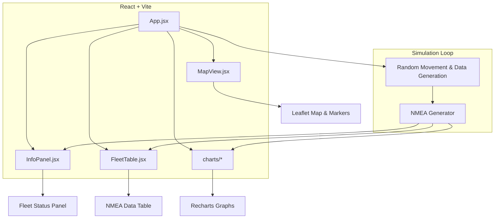

# React Fleet Tracker Demo (React + Vite)

This project is a demo application built with React and Vite that showcases real-time GPS tracking of vehicles (a fleet tracker). It includes client-side simulation of GPS data, interactive mapping, and data visualization, mimicking a simplified server-like GPS telemetry stream.

## System Architecture



- **App.jsx**: Orchestrates state and simulation loop.
- **MapView.jsx**: Initializes Leaflet map, renders/upates markers, handles clicks to add vehicles.
- **InfoPanel.jsx**: Displays each vehicle’s live coordinates and NMEA strings in a styled panel.
- **FleetTable.jsx**: Renders a toggleable table of parsed NMEA data (GGA, ZDA, GSV) and random metrics (altitude, sats, HDOP).
- **charts/**: Contains `AltitudeGraph.jsx`, `SatsGraph.jsx`, `HDOPGraph.jsx` for data visualization using Recharts.
- **nmeaUtils.js**: Computes and appends NMEA checksums.

## Limitations

- **No Backend Integration**: All data is generated and managed client-side; no server, database, or persistent storage.
- **Static Simulation**: Location updates are random offsets, not tied to real routes or map features.
- **No Real-Time Streaming Protocol**: Lacks WebSocket/MQTT; uses simple `setInterval` loops.
- **No Authentication or Device Management**: Vehicles are added ad-hoc without IDs or security.
- **Ideal Conditions Assumed**: No GPS drift, signal loss, noise filtering, or error handling beyond checksum.

## Future Improvements

- **Backend Service**: Integrate Node.js/Express or Firebase to store telemetry and history.
- **Real GPS Input**: Use `navigator.geolocation` or mobile device GPS for live data feed.
- **Streaming Protocols**: Replace `setInterval` with WebSocket or MQTT for realistic telemetry.
- **Route Adherence**: Snap simulated points to real road network using a routing API.
- **Authentication & Device Registry**: Manage vehicle identities, sessions, and access control.
- **Error Handling & Retries**: Simulate and manage data gaps, reconnections, and invalid data scenarios.
- **Historical Playback**: Store and replay past routes and telemetry for analysis.
- **Geo-fencing & Alerts**: Trigger notifications when vehicles enter/exit defined zones.
- **Mobile/Responsive UI**: Optimize for different screen sizes and touch interactions.

## Getting Started

### Prerequisites

- [Node.js](https://nodejs.org/) (v16+ recommended)
- npm or yarn

### Installation

```bash
# Clone repository
git clone git@github.com:Minhcardanian/6tracking-react.git
cd 6tracking-react

# Install dependencies
npm install
npm install leaflet react-mermaid2

# Start development server
npm run dev
```

Open <http://localhost:5173> in your browser to view the app.

---

For more details and source code, visit [GitHub repo](https://github.com/YourUser/YourRepo).

