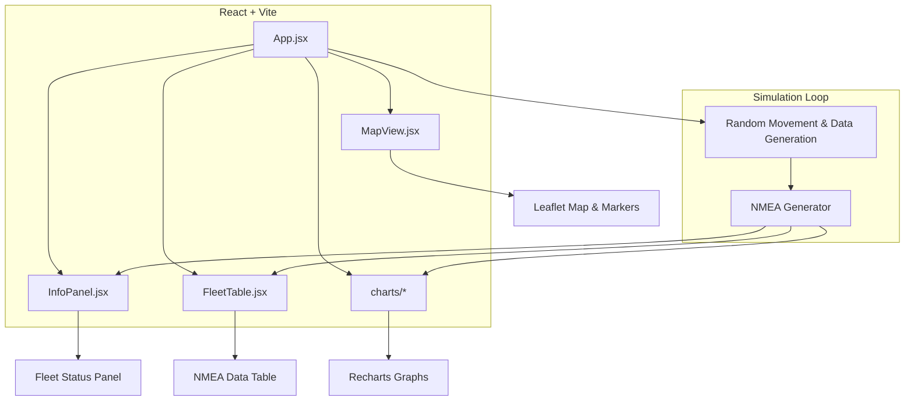
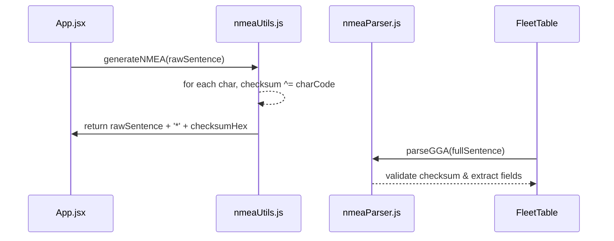

# React Fleet Tracker Demo (React + Vite)

This project is a demo application built with React and Vite that showcases real-time GPS tracking of vehicles (a fleet tracker). It includes client-side simulation of GPS data, interactive mapping, and data visualization, mimicking a simplified server-like GPS telemetry stream.

## System Architecture



- **App.jsx**: Orchestrates state, simulation loop, and overlay toggles.
- **MapView.jsx**: Initializes the Leaflet map, manages a `markersRef` object to store L.marker instances, and on each state update calls `markersRef.current[id].setLatLng(newCoords)` to smoothly move existing markers; also handles adding new vehicles on map clicks.
- **InfoPanel.jsx**: Displays vehicle coordinates and NMEA strings in a styled panel.
- **FleetTable.jsx**: Renders parsed NMEA data (GGA, ZDA, GSV) and random metrics (altitude, sats, HDOP) in a table.
- **charts/**: `AltitudeGraph.jsx`, `SatsGraph.jsx`, `HDOPGraph.jsx` visualize metrics using Recharts.
- **nmeaUtils.js**: Generates NMEA sentences with proper checksums.

## Core Logic

- **Simulation Loop (App.jsx)**: Uses a `useEffect` hook with `setInterval` (every 0.8s) to update each vehicle’s:
  - **Coordinates** (random latitude/longitude offsets)
  - **Metrics** (altitude, satellite count, HDOP)
  - **NMEA sentences** (GGA, ZDA, GSV) by calling `generateNMEA(rawSentence)`
- **NMEA Utility (`nmeaUtils.js`)**: Parses raw sentences, computes and appends a checksum suffix according to NMEA standards.
- **Marker Management (`MapView.jsx`)**: Maintains a `markersRef` map of Leaflet markers, using `marker.setLatLng()` to smoothly animate each vehicle’s marker to new coordinates on state updates.
- **Data Parsing (`FleetTable.jsx`)**: Utilizes `parseGGA` and `parseZDA` functions to extract latitude, longitude, altitude, fix quality, and timestamp from NMEA strings for display.
- **UI State Toggles**: Three React state flags (`showTable`, `showGraphs`, `showDocs`) control conditional rendering of the NMEA data table, Recharts graphs, and documentation overlay.

### Checksum Computation & Parsing

To ensure message integrity, each NMEA sentence ends with a checksum suffix: `*HH`, where `HH` is a two-digit hexadecimal value. The checksum is computed as the bitwise XOR of all characters between `$` and `*`.



- **Checksum Calculation**: Iterates over each byte of the raw sentence (excluding `$`), XOR-ing their ASCII codes.
- **Suffix Appending**: Converts the resulting byte to a two-digit hex string and appends it after `*`.
- **Parsing & Validation**: `parseGGA` and `parseZDA` functions verify the checksum before splitting the sentence into its comma-separated fields.

**Example**:
```
$GPGGA,123519,4807.038,N,01131.000,E,1,08,0.9,545.4,M,46.9,M,,*47
```**: Three React state flags (`showTable`, `showGraphs`, `showDocs`) control conditional rendering of the NMEA data table, Recharts graphs, and documentation overlay.


## Limitations

- **No Backend Integration**: Simulation and state exist purely on the client; no persistent storage.
- **Simplified Movement**: Vehicles move by random offsets, not along actual roads.
- **Polling vs. Streaming**: Uses `setInterval` instead of real-time protocols like WebSockets or MQTT.
- **No Authentication or Device Registry**: Vehicles are ephemeral and have no security controls.
- **Ideal Signal Conditions**: No handling of GPS noise, loss, or drift beyond a simulated HDOP value.

## Future Improvements

- **Backend Service**: Add a server (Node.js, Firebase) to store and retrieve vehicle telemetry.
- **Live GPS Data**: Use device geolocation (`navigator.geolocation`) or real GPS modules for true location data.
- **Real-Time Streaming**: Replace polling with WebSocket or MQTT streams for low-latency updates.
- **Route Adherence**: Integrate a routing API to constrain movement along actual roads.
- **Device Management**: Implement authentication, device IDs, and role-based access control.
- **Error Handling**: Simulate and recover from GPS signal loss, data gaps, and checksum failures.
- **Historical Playback**: Persist and replay past telemetry for performance analysis.
- **Geo-fencing & Alerts**: Trigger notifications when vehicles enter/exit defined areas.
- **Responsive & Mobile UI**: Optimize the layout for various screen sizes and touch interactions.

## Getting Started

### Prerequisites

- [Node.js](https://nodejs.org/) (v16+)
- npm or yarn

### Installation

```bash
# Clone the repo
git clone git@github.com:Minhcardanian/6tracking-react.git
cd 6tracking-react

# Install dependencies
npm install
npm install leaflet react-mermaid2

# Run the dev server
npm run dev
```

Open <http://localhost:5173> to view the app. Click on the map to add vehicles and toggle the overlays for tables, graphs, and documentation.

---

## Glossary

| Term | Description |
| --- | --- |
| GGA | GPS Fix Data sentence (latitude, longitude, altitude, fix quality, number of satellites, HDOP). |
| ZDA | Time & Date sentence (UTC-based timestamp and calendar date). |
| GSV | Satellites in View sentence (details of visible satellites). |
| NMEA | National Marine Electronics Association protocol for standard GPS sentences. |
| HDOP | Horizontal Dilution of Precision (measure of horizontal positional accuracy). |

---

For source code and contributions, see the [GitHub repository](https://github.com/YourUser/YourRepo).

